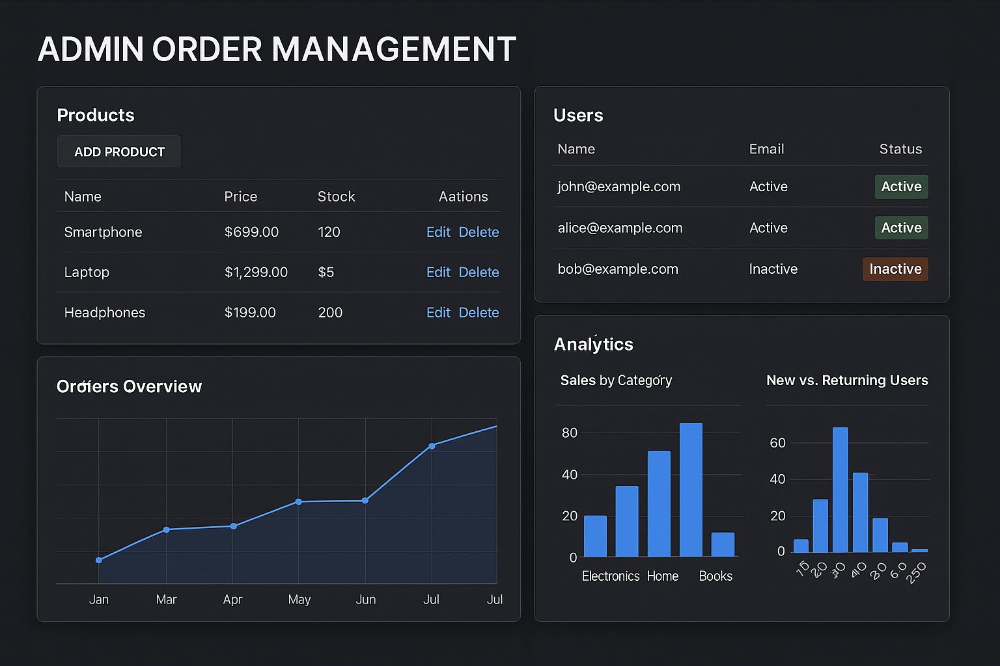

# Hey, I'm Sunil Shah 👋

> _Software engineer, open source advocate, and lifelong tinkerer — from soldering circuits in Nepal to building AI systems in Washington, DC._

I taught myself electronics and programming from scratch using free internet resources, Stack Overflow, Reddit, and YouTube. That experience shaped how I think about technology: as something that should be open, learnable, and community-driven. I now channel that belief into my work as a **Student Ambassador at GWU's Open Source Program Office** and as a contributor to projects that span robotics, AI, infrastructure, and the open web.

---

## 🎓 Currently

- **MS in Computer Science** — George Washington University, SEAS ( graduating May 2026)
- **Student Ambassador** — GWU Open Source Program Office (OSPO), advocating for open source culture across campus and beyond
- **Actively seeking full-time new grad software engineering roles** — especially in infrastructure, systems, and AI-adjacent engineering

---

## 🔨 What I'm Working On

<table>
	<tr>
		<td width="50%" valign="top">
			<strong>Life Insurance RAG Chatbot</strong> 
			 
			A retrieval-augmented generation system for insurance domain Q&amp;A, built with Next.js, Rust, ChromaDB, and Gemma.
		</td>
		<td width="50%" valign="top">
			<strong>Cover Letter Generator</strong> 
			 
			A TypeScript tool that auto-generates tailored cover letters from a resume and job description using the Gemini API.
			<a href="https://github.com/Sunilshah-7/Cover-letter-generator">View repo</a>
		</td>
	</tr>
	<tr>
		<td width="50%" valign="top">
			<strong>Agentic Tutor</strong> 
			 
			A web tool that extracts key details from long YouTube videos, summarizes them, generates Q&amp;A, and helps with active learning using YouTube transcript APIs and Whisper speech-to-text.
		</td>
		<td width="50%" valign="top">
			<strong>Admin Dashboard</strong> 
			 
			A dashboard powered by React and Django to visualize trends and insights from your data.
		</td>
	</tr>
</table>

Also, I am sharpening systems programming skills in **memory management, concurrency, virtual memory, and Rust** in preparation for infrastructure engineering roles

---

## 🌐 Open Source Contributions

Open source is where I learned to code — it's only natural that I give back.

| Project                                                                                                                    | Organization           | Contribution                                                                                                   |
| -------------------------------------------------------------------------------------------------------------------------- | ---------------------- | -------------------------------------------------------------------------------------------------------------- |
| [UNSDG Classifier Tool](https://github.com/chaoss/UNSDG-classifier-tool)                                                   | **CHAOSS**             | Built a UN Sustainable Development Goals text classifier; featured in GW Open Source conference lightning talk |
| [GW Civic Learning Site](https://github.com/GW-Civic-Learning/gw-civic-learning.github.io)                                 | **GWU Nashman Center** | Contributed to the civic engagement and learning platform for George Washington University                     |
| [Student Outreach Strategy Pattern](https://github.com/CURIOSSorg/curioss-patterns/blob/main/student-outreach-strategy.md) | **CURIOSS**            | Authored a community pattern on student outreach strategy for university and research OSPOs                    |
| [GW OSPO](https://github.com/gw-ospo)                                                                                      | **GWU OSPO**           | Active contributor and ambassador; supporting open source education and community programs                     |

---

## 🛠️ Skills & Technologies

**Languages**

	

**Web & Frameworks**

	

**AI / ML / Data**

	
	
	
	
	
	
	
	
	

**Robotics**

	
	

**Databases & Backend**

	
	

**DevOps & Infrastructure**

	

**Design & Tooling**

	

---

## 📂 Featured Projects

### 🤖 Blind Spot Detection with LiDAR + ROS

Real-time blind spot alerting system using YDLiDAR sensor data and ROS middleware in C++. Built as part of my robotics engineering work.
[→ View repo](https://github.com/Sunilshah-7/ydlidar_ros)

### ✍️ Cover Letter Generator

TypeScript tool that takes your resume and a job description and uses the Gemini API to produce a tailored cover letter — because the process should be faster.
[→ View repo](https://github.com/Sunilshah-7/Cover-letter-generator)

### 🧠 CHAOSS UNSDG Classifier

Open source NLP classifier that tags text against the 17 UN Sustainable Development Goals. Contributed to the CHAOSS community and presented as a case study in an open source conference lightning talk.
[→ View repo](https://github.com/chaoss/UNSDG-classifier-tool)

---

## 🏆 GitHub Achievements

🦈 Pull Shark ×3 &nbsp;|&nbsp; 👥 Pair Extraordinaire &nbsp;|&nbsp; 🎯 YOLO &nbsp;|&nbsp; ⚡ Quickdraw &nbsp;|&nbsp; 🧊 Arctic Code Vault Contributor

---

## 📊 GitHub Metrics

	
	

	

---

## ⚡ Fun Facts

- I started learning electronics and programming entirely through free internet resources — no formal training until university
- My GitHub spans robotics, prosthetics, LiDAR, computer vision, web apps, mobile apps, and now AI infrastructure — I follow curiosity wherever it leads
- I believe **sleep is more important than grinding** for doing your best technical work
- I went from wiring Arduinos in Nepal to contributing to global open source communities and studying at a George Washington university in Washington, DC

---

## 📫 Let's Connect

I'm always happy to talk about technologies, open source, robotics, or anything in between.

---

_"The best way to learn is to build something real for someone who needs it."_
